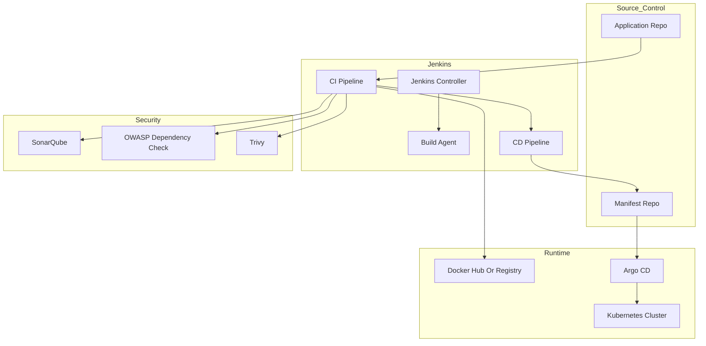
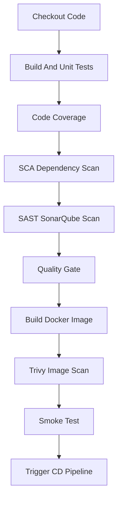
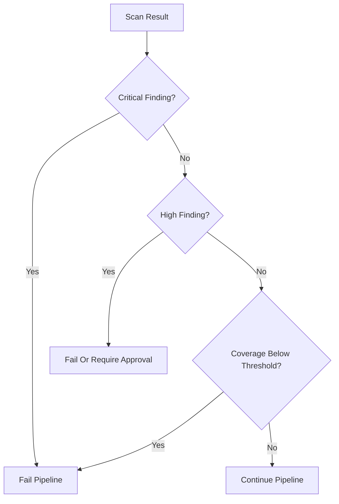
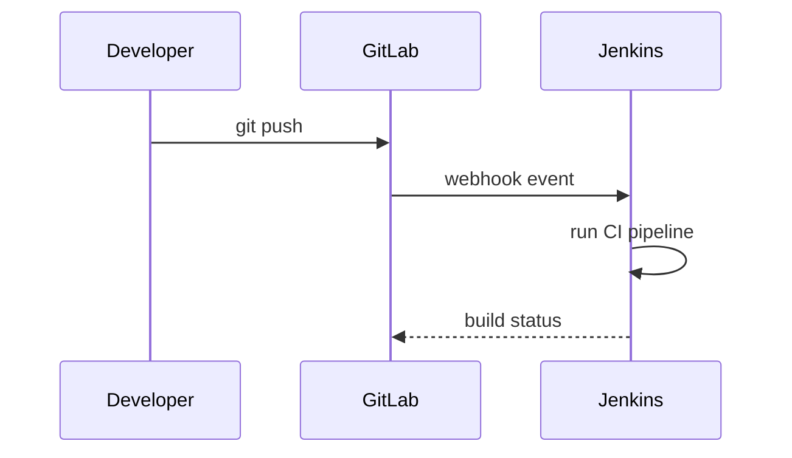
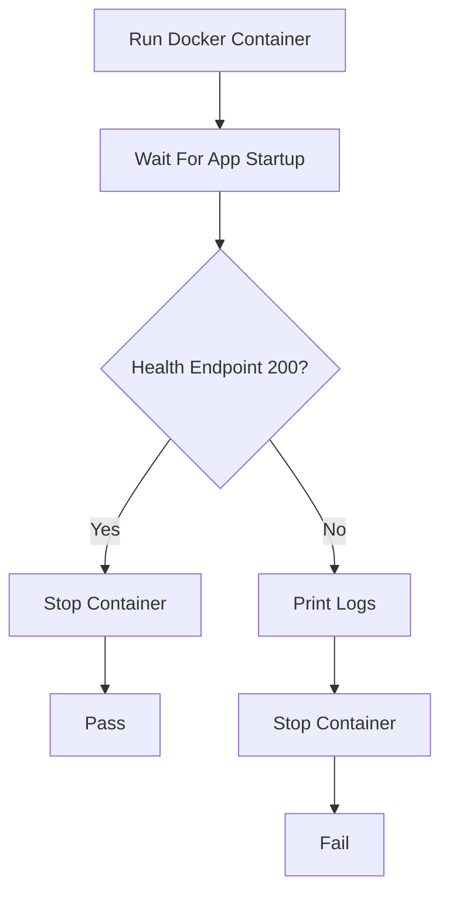
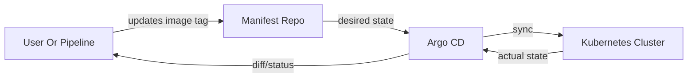
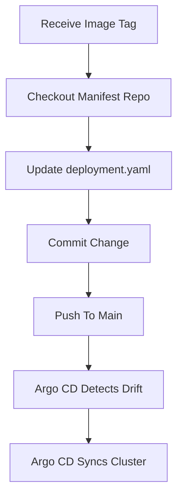
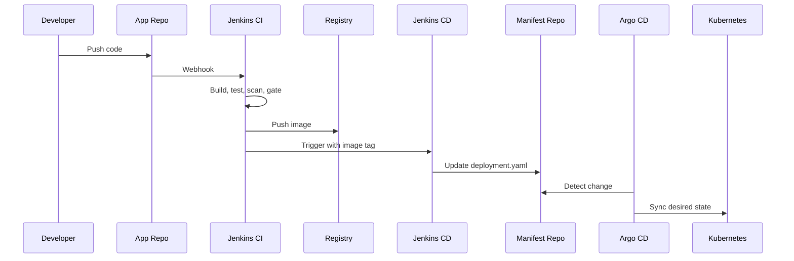

# DevSecOps Real-World CI/CD Playbook

An end-to-end guide for building a secure CI/CD workflow with Jenkins, Maven,
SonarQube, OWASP Dependency Check, Docker, Trivy, Kubernetes, and Argo CD.

This playbook converts the original class transcript into a ready-to-use
reference guide. It is organized as a practical walkthrough: understand the
flow, prepare the tools, build the CI pipeline, add security gates, create the
GitOps-based CD pipeline, and connect everything into a complete DevSecOps
delivery system.

## Quick Navigation

1. [What You Are Building](#what-you-are-building)
2. [End-To-End Flow](#end-to-end-flow)
3. [Core Concepts](#core-concepts)
4. [Reference Architecture](#reference-architecture)
5. [Tooling Checklist](#tooling-checklist)
6. [CI Build Pipeline](#ci-build-pipeline)
7. [Security Gates](#security-gates)
8. [Jenkins Setup](#jenkins-setup)
9. [SonarQube Setup](#sonarqube-setup)
10. [GitLab Webhook Setup](#gitlab-webhook-setup)
11. [Docker Image Build And Scan](#docker-image-build-and-scan)
12. [Smoke Test](#smoke-test)
13. [GitOps CD With Argo CD](#gitops-cd-with-argo-cd)
14. [CD Pipeline](#cd-pipeline)
15. [Connecting CI And CD](#connecting-ci-and-cd)
16. [Troubleshooting](#troubleshooting)
17. [Operational Runbook](#operational-runbook)
18. [Interview Talking Points](#interview-talking-points)

## What You Are Building

You are building a modern DevSecOps delivery workflow where:

- Developers push application code to Git.
- Jenkins automatically runs the CI build pipeline.
- The pipeline builds and tests the application.
- Security scans run before the artifact is trusted.
- SonarQube applies quality gates.
- Docker image is built and pushed only after the code passes checks.
- Trivy scans the container image.
- A smoke test validates the image starts correctly.
- Jenkins triggers a separate CD pipeline.
- The CD pipeline updates Kubernetes manifests in a GitOps repo.
- Argo CD watches the manifest repo and deploys the change to Kubernetes.

The important real-world design decision is this:

> CI and CD are separated into two pipelines. CI creates a trusted deployable
> artifact. CD updates the desired deployment state. Argo CD performs the actual
> deployment from Git into Kubernetes.

## End-To-End Flow

```mermaid
flowchart LR
    DEV[Developer] -->|push code| APP_REPO[Application Git Repo]
    APP_REPO -->|webhook| JENKINS_CI[Jenkins CI Pipeline]
    JENKINS_CI --> CHECKOUT[Checkout]
    CHECKOUT --> BUILD[Build And Unit Test]
    BUILD --> COVERAGE[Code Coverage]
    COVERAGE --> SCA[SCA Dependency Scan]
    SCA --> SAST[SAST SonarQube Scan]
    SAST --> QG[Quality Gate]
    QG --> IMAGE[Build Docker Image]
    IMAGE --> TRIVY[Trivy Image Scan]
    TRIVY --> SMOKE[Smoke Test]
    SMOKE --> REGISTRY[Container Registry]
    SMOKE -->|trigger with image tag| JENKINS_CD[Jenkins CD Pipeline]
    JENKINS_CD --> MANIFEST_REPO[GitOps Manifest Repo]
    MANIFEST_REPO -->|watched by| ARGO[Argo CD]
    ARGO --> K8S[Kubernetes Cluster]
    K8S --> USERS[Users]
```



## Core Concepts

### Continuous Delivery

Continuous delivery means the product is always kept in a releasable state.
Developers continuously write code, QA continuously validates, and the platform
continuously prepares safe releases.

### Continuous Integration

Continuous integration is the first half of the delivery system. Whenever code
is pushed, Jenkins checks out the code, builds it, tests it, scans it, and tells
the developer quickly whether the change is safe.

### Continuous Deployment

Continuous deployment is the second half. Once the application artifact is
trusted, the system updates the runtime environment so users can access the new
version.

### DevSecOps

DevSecOps means security checks are included directly inside the delivery
pipeline. Security is not a separate final review. It becomes part of build,
test, scan, gate, image creation, deployment, and operations.

### Why CI And CD Should Be Separate

A single pipeline that builds code and directly runs `kubectl apply` looks
simple, but it causes real operational problems:

- Jenkins needs access to production Kubernetes credentials.
- Re-deploying an older image becomes difficult.
- QA and production deployments become mixed with build logic.
- Users may need to rebuild even when they only want to deploy.
- Auditability is weaker because deployment state is not stored cleanly in Git.

A better pattern is:

- CI pipeline builds and publishes the artifact.
- CD pipeline updates the GitOps manifest.
- Argo CD deploys the desired state into Kubernetes.

## Reference Architecture



## Tooling Checklist

| Area | Tool | Purpose |
|---|---|---|
| Source control | GitLab or GitHub | Stores application and manifest code |
| CI/CD | Jenkins | Runs build and deployment pipelines |
| Build | Maven | Builds Java or Spring Boot application |
| Unit test | Maven test plugins | Runs unit tests |
| Coverage | JaCoCo | Measures how much code is covered by tests |
| SCA | OWASP Dependency Check | Finds vulnerable third-party dependencies |
| SAST | SonarQube | Static code analysis and maintainability checks |
| Quality gate | SonarQube Quality Gate | Blocks pipeline if standards are not met |
| Image build | Docker | Packages application into a container image |
| Image scan | Trivy | Scans container image vulnerabilities |
| Runtime validation | Smoke test script | Confirms the image starts and health endpoint works |
| Deployment | Kubernetes | Runs application workloads |
| GitOps | Argo CD | Syncs Kubernetes manifests from Git to cluster |

## Repository Layout Used In This Lab

```text
demo/
  Dockerfile
  Jenkinsfile
  Jenkinsfile-cicd
  smoke-test.sh
  trivy-scan.sh
  kubernetes/
    deployment.yaml
    service.yaml
```

The same layout can be split into two repositories in a production-like setup:

```text
application-repo/
  src/
  pom.xml
  Dockerfile
  Jenkinsfile

manifest-repo/
  kubernetes/
    deployment.yaml
    service.yaml
  Jenkinsfile-cicd
```

## CI Build Pipeline

The CI pipeline is responsible for producing a trusted deployable artifact.

### CI Stage Flow



### Stage 1: Checkout

The pipeline checks out the correct repository and branch.

```groovy
stage('Checkout') {
  steps {
    checkout scm
  }
}
```

Use branch strategy carefully:

- Feature branch: early feedback for developers.
- Integration branch: shared validation before release.
- Main branch: release candidate or production build.

### Stage 2: Build And Unit Tests

The build converts source code into an artifact and runs unit tests.

```groovy
stage('Build & Unit Tests') {
  steps {
    sh 'mvn -B -DskipTests=false clean package'
  }
}
```

Expected output for a Spring Boot project:

```text
target/*.jar
```

Why run unit tests again if developers already tested locally?

Because the pipeline tests the integrated code from the repository, not only the
files changed on one developer workstation.

### Stage 3: Code Coverage

Code coverage shows whether the tests actually cover enough of the codebase.

```groovy
stage('Code Coverage') {
  steps {
    sh 'echo "Code coverage report produced by JaCoCo (mvn)"'
  }
}
```

Recommended policy:

| Metric | Example Gate |
|---|---|
| Line coverage | Minimum 80 percent |
| New code coverage | Minimum 80 to 90 percent |
| Critical modules | Higher threshold than general code |

Code coverage is not proof that the application is bug-free. It is a signal that
the tests are exercising enough of the application to be useful.

### Stage 4: SCA Dependency Scan

Software Composition Analysis checks third-party libraries for known
vulnerabilities.

```groovy
stage('SCA - Dependency Check') {
  steps {
    sh 'mvn org.owasp:dependency-check-maven:check'
  }
}
```

Use SCA to catch risks such as:

- Vulnerable Maven dependencies.
- Known CVEs in framework libraries.
- Outdated transitive dependencies.
- Libraries with severe security advisories.

### Stage 5: SAST SonarQube Scan

Static Application Security Testing scans source code for bugs, code smells,
security issues, and maintainability problems.

```groovy
stage('SonarQube Scan') {
  steps {
    withSonarQubeEnv(SONAR_SERVER) {
      sh 'mvn sonar:sonar -Dsonar.projectKey=demo-app'
    }
  }
}
```

SonarQube can combine:

- Code quality findings.
- SAST findings.
- Coverage results.
- Dependency check results, if configured with plugins or reports.

### Stage 6: Quality Gate

The quality gate decides whether the pipeline is allowed to continue.

```groovy
stage('Quality Gate') {
  steps {
    timeout(time: 5, unit: 'MINUTES') {
      waitForQualityGate abortPipeline: true
    }
  }
}
```

Typical quality gate rules:

| Gate | Recommended Action |
|---|---|
| Critical vulnerability | Fail |
| High vulnerability | Fail or require approval |
| Coverage below threshold | Fail |
| New blocker bug | Fail |
| Maintainability rating poor | Warn or fail based on policy |

## Security Gates

Security gates should be explicit. A pipeline should not silently pass when
security tools fail.

### Recommended Gate Model



### Gate Policy Example

```yaml
quality_policy:
  code_coverage:
    minimum_line_coverage: 80
    minimum_new_code_coverage: 80
  dependency_scan:
    fail_on:
      - CRITICAL
      - HIGH
  container_scan:
    fail_on:
      - CRITICAL
  sast:
    fail_on:
      - BLOCKER
      - CRITICAL
```

### Important Note About Demo Policy

The demo Jenkinsfile currently allows the Trivy stage to continue:

```groovy
sh "trivy image --exit-code 1 --severity CRITICAL ${env.IMAGE_NAME} || true"
```

For production, remove `|| true` if you want critical vulnerabilities to fail
the pipeline:

```groovy
sh "trivy image --exit-code 1 --severity CRITICAL ${env.IMAGE_NAME}"
```

## Jenkins Setup

### Jenkins Topology

Use at least two machines:

| Machine | Purpose |
|---|---|
| Jenkins controller | Jenkins UI, job orchestration, plugin management |
| Build agent | Maven build, Docker build, Trivy scan, smoke test |

Optional third machine:

| Machine | Purpose |
|---|---|
| Kubernetes node or Minikube host | Runs Argo CD and demo application |

### Required Jenkins Plugins

Install these plugins:

- Pipeline
- Git
- Docker Pipeline
- SonarQube Scanner
- SSH Build Agents
- Parameterized Trigger, if using downstream parameterized builds

### Build Agent Requirements

The build agent should have:

- Java JDK compatible with the application.
- Maven.
- Docker.
- Trivy.
- Git.
- Curl.

Verify the tools:

```bash
java -version
mvn -version
docker version
trivy --version
git --version
curl --version
```

### Add Jenkins Build Node

In Jenkins:

1. Go to `Manage Jenkins`.
2. Open `Nodes`.
3. Create a new node named `build`.
4. Use label `build`.
5. Configure SSH connection to the build server.
6. Confirm the node is online.

The demo Jenkinsfile uses this label:

```groovy
pipeline {
  agent { label 'build' }
}
```

### Jenkins Credentials

Create these Jenkins credentials:

| Credential ID | Type | Purpose |
|---|---|---|
| `dockerhub` | Username/password or token | Push image to Docker Hub |
| `sonar_token` | Secret text | Authenticate with SonarQube |
| `gitlab_cred` | Username/password or token | Checkout and push Git repos |

The demo pipeline references them here:

```groovy
environment {
  DOCKER_REGISTRY = 'docker.io/your-username'
  REGISTRY_CREDENTIAL_ID = 'dockerhub'
  SONAR_SERVER = 'mySonar'
  SONAR_CRED = 'sonar_token'
  GIT_CRED = 'gitlab_cred'
}
```

## SonarQube Setup

### Run SonarQube With Docker

For a lab environment:

```bash
docker run -d --name sonarqube -p 9000:9000 sonarqube:lts-community
```

Open:

```text
http://<sonarqube-host>:9000
```

### Configure SonarQube In Jenkins

In Jenkins:

1. Go to `Manage Jenkins`.
2. Open `System`.
3. Find `SonarQube servers`.
4. Add a server named `mySonar`.
5. Add the SonarQube URL.
6. Select the `sonar_token` credential.

The name must match the pipeline value:

```groovy
SONAR_SERVER = 'mySonar'
```

### Configure SonarQube Webhook

SonarQube must call back to Jenkins for `waitForQualityGate`.

In SonarQube:

1. Go to `Administration`.
2. Open `Configuration`.
3. Open `Webhooks`.
4. Add Jenkins webhook URL:

```text
http://<jenkins-host>:8080/sonarqube-webhook/
```

## GitLab Webhook Setup

The GitLab webhook triggers the CI pipeline automatically when code is pushed.

### Flow



### Steps

1. Open the GitLab project.
2. Go to `Settings`.
3. Open `Webhooks`.
4. Add the Jenkins job webhook URL.
5. Select push events.
6. Test the webhook.
7. Confirm Jenkins receives HTTP 200.

Example webhook URL pattern:

```text
http://<jenkins-host>:8080/project/<job-name>
```

The exact URL depends on the Jenkins plugin and job type.

## Docker Image Build And Scan

### Dockerfile

The demo Dockerfile packages a Spring Boot JAR:

```dockerfile
FROM openjdk:17-jdk-slim
WORKDIR /app
COPY target/*.jar app.jar
EXPOSE 8080
ENTRYPOINT ["java", "-jar", "/app/app.jar"]
```

### Build And Push Image

Jenkins builds and pushes an image tagged with the Jenkins build number.

```groovy
stage('Build Docker Image') {
  steps {
    script {
      def imageName = "${DOCKER_REGISTRY}/demo-app:${env.BUILD_NUMBER}"
      docker.withRegistry('', REGISTRY_CREDENTIAL_ID) {
        def img = docker.build(imageName)
        img.push()
      }
      env.IMAGE_NAME = imageName
    }
  }
}
```

Tagging strategy:

| Tag | Use Case |
|---|---|
| Jenkins build number | Simple lab traceability |
| Git commit SHA | Strong production traceability |
| Semantic version | Release versioning |
| Environment tag | Avoid for immutable deployments |

### Trivy Image Scan

Run Trivy against the built image:

```groovy
stage('Image Scan (Trivy)') {
  steps {
    sh "trivy image --exit-code 1 --severity CRITICAL ${env.IMAGE_NAME} || true"
  }
}
```

Standalone script from this repo:

```bash
#!/usr/bin/env bash
set -euo pipefail
IMAGE="$1"
OUT=trivy-result.json

trivy image --format json --output "$OUT" "$IMAGE"

if command -v jq >/dev/null 2>&1; then
  high=$(jq '.Results[].Vulnerabilities[]? | select(.Severity=="CRITICAL" or .Severity=="HIGH")' "$OUT" | wc -l)
  if [ "$high" -gt 0 ]; then
    echo "trivy: found HIGH/CRITICAL vulnerabilities"
    jq . "$OUT"
    exit 1
  fi
fi

echo "trivy: no HIGH/CRITICAL vulnerabilities (or jq not installed)"
exit 0
```

## Smoke Test

The smoke test confirms the container starts and responds to the health endpoint.

### Smoke Test Flow



### Demo Smoke Test

```bash
#!/usr/bin/env bash
set -euo pipefail
IMAGE="$1"
NAME=temp-demo-$RANDOM

docker run -d --rm --name "$NAME" -p 8080:8080 "$IMAGE"

for i in {1..18}; do
  sleep 5
  if curl -s -o /dev/null -w "%{http_code}" http://localhost:8080/actuator/health | grep -q "200"; then
    echo "smoke: application healthy"
    docker rm -f "$NAME" >/dev/null 2>&1 || true
    exit 0
  fi
  echo "waiting for app... ($i)"
done

echo "smoke: app did not become healthy"
docker logs "$NAME" || true
docker rm -f "$NAME" || true
exit 1
```

Jenkins stage:

```groovy
stage('Smoke Test') {
  steps {
    sh "./demo/smoke-test.sh ${env.IMAGE_NAME}"
  }
}
```

## GitOps CD With Argo CD

### Why GitOps

In a traditional deployment, Jenkins may run `kubectl apply` directly. That
works in a demo, but it is risky in production because Jenkins needs cluster
access.

GitOps changes the model:

- Kubernetes YAML is stored in Git.
- Jenkins updates only the YAML in Git.
- Argo CD watches Git.
- Argo CD syncs Kubernetes to match Git.
- Git becomes the audit trail for deployment state.

### GitOps Flow



### Kubernetes Deployment

```yaml
apiVersion: apps/v1
kind: Deployment
metadata:
  name: demo-app
spec:
  replicas: 2
  selector:
    matchLabels:
      app: demo-app
  template:
    metadata:
      labels:
        app: demo-app
    spec:
      containers:
        - name: demo-app
          image: docker.io/your-username/demo-app:REPLACE_IMAGE
          ports:
            - containerPort: 8080
          readinessProbe:
            httpGet:
              path: /actuator/health
              port: 8080
            initialDelaySeconds: 10
            periodSeconds: 10
```

### Kubernetes Service

```yaml
apiVersion: v1
kind: Service
metadata:
  name: demo-app-service
spec:
  type: NodePort
  selector:
    app: demo-app
  ports:
    - protocol: TCP
      port: 80
      targetPort: 8080
      nodePort: 31080
```

### Install Argo CD In A Lab Cluster

Create namespace:

```bash
kubectl create namespace argocd
```

Install Argo CD:

```bash
kubectl apply -n argocd -f https://raw.githubusercontent.com/argoproj/argo-cd/stable/manifests/install.yaml
```

Expose Argo CD for local testing:

```bash
kubectl port-forward svc/argocd-server -n argocd 8081:443
```

Open:

```text
https://localhost:8081
```

### Create Argo CD Application

Point Argo CD to:

```text
repoURL: <manifest-repo-url>
path: kubernetes
targetRevision: main
destination: Kubernetes cluster namespace
```

Recommended sync settings:

| Environment | Sync Policy |
|---|---|
| Development | Automatic sync |
| QA | Manual or automatic with approvals |
| Production | Manual sync with release approval |

## CD Pipeline

The CD pipeline updates the image tag in the manifest repo.

### CD Pipeline Flow



### Jenkins CD Pipeline

```groovy
pipeline {
  agent any
  parameters {
    string(name: 'IMAGE_TAG', defaultValue: 'latest', description: 'Image tag to deploy')
    string(name: 'REPO_URL', defaultValue: '', description: 'Git repo with k8s manifests')
  }
  environment {
    GIT_CRED = 'gitlab_cred'
  }
  stages {
    stage('Checkout manifests') {
      steps {
        checkout([$class: 'GitSCM', branches: [[name: '*/main']], userRemoteConfigs: [[url: params.REPO_URL, credentialsId: env.GIT_CRED]]])
      }
    }

    stage('Update image tag') {
      steps {
        sh "sed -i 's|image: .*|image: docker.io/your-username/demo-app:${IMAGE_TAG}|' kubernetes/deployment.yaml"
        sh 'git config user.email "jenkins@example.com"'
        sh 'git config user.name "Jenkins CI"'
        sh 'git add kubernetes/deployment.yaml'
        sh 'git commit -m "ci: update image tag to ${IMAGE_TAG} [ci skip]" || true'
        sh 'git push origin main'
      }
    }
  }
}
```

### CD Parameters

| Parameter | Example | Purpose |
|---|---|---|
| `IMAGE_TAG` | `25` or `build-25` | Selects image to deploy |
| `REPO_URL` | Git manifest repo URL | Tells Jenkins where Kubernetes YAML lives |

## Connecting CI And CD

The CI pipeline triggers the CD pipeline after the image passes all checks.

```groovy
stage('Trigger CD') {
  steps {
    build job: 'demo-cd',
      parameters: [
        string(name: 'IMAGE_TAG', value: "${env.BUILD_NUMBER}"),
        string(name: 'REPO_URL', value: scm.userRemoteConfigs[0].url)
      ],
      wait: false
  }
}
```

In a production layout, pass the manifest repo URL instead of the application
repo URL.

### Final CI/CD Flow



## Complete Jenkins CI Pipeline Example

```groovy
pipeline {
  agent { label 'build' }
  environment {
    DOCKER_REGISTRY = 'docker.io/your-username'
    REGISTRY_CREDENTIAL_ID = 'dockerhub'
    SONAR_SERVER = 'mySonar'
    SONAR_CRED = 'sonar_token'
    GIT_CRED = 'gitlab_cred'
  }
  stages {
    stage('Checkout') {
      steps {
        checkout scm
      }
    }

    stage('Build & Unit Tests') {
      steps {
        sh 'mvn -B -DskipTests=false clean package'
      }
    }

    stage('Code Coverage') {
      steps {
        sh 'echo "Code coverage report produced by JaCoCo (mvn)"'
      }
    }

    stage('SCA - Dependency Check') {
      steps {
        sh 'mvn org.owasp:dependency-check-maven:check'
      }
    }

    stage('SonarQube Scan') {
      steps {
        withSonarQubeEnv(SONAR_SERVER) {
          sh 'mvn sonar:sonar -Dsonar.projectKey=demo-app'
        }
      }
    }

    stage('Quality Gate') {
      steps {
        timeout(time: 5, unit: 'MINUTES') {
          waitForQualityGate abortPipeline: true
        }
      }
    }

    stage('Build Docker Image') {
      steps {
        script {
          def imageName = "${DOCKER_REGISTRY}/demo-app:${env.BUILD_NUMBER}"
          docker.withRegistry('', REGISTRY_CREDENTIAL_ID) {
            def img = docker.build(imageName)
            img.push()
          }
          env.IMAGE_NAME = imageName
        }
      }
    }

    stage('Image Scan (Trivy)') {
      steps {
        sh "trivy image --exit-code 1 --severity CRITICAL ${env.IMAGE_NAME} || true"
      }
    }

    stage('Smoke Test') {
      steps {
        sh "./demo/smoke-test.sh ${env.IMAGE_NAME}"
      }
    }

    stage('Trigger CD') {
      steps {
        build job: 'demo-cd',
          parameters: [
            string(name: 'IMAGE_TAG', value: "${env.BUILD_NUMBER}"),
            string(name: 'REPO_URL', value: scm.userRemoteConfigs[0].url)
          ],
          wait: false
      }
    }
  }
  post {
    always {
      archiveArtifacts artifacts: 'target/*.jar', allowEmptyArchive: true
    }
  }
}
```

## Hands-On Walkthrough

### Step 1: Prepare Jenkins

1. Install required plugins.
2. Add build agent with label `build`.
3. Add Docker registry credential.
4. Add Git credential.
5. Add SonarQube token.
6. Configure SonarQube server as `mySonar`.

### Step 2: Prepare Build Agent

```bash
java -version
mvn -version
docker version
trivy --version
```

Make sure Jenkins user can run Docker:

```bash
docker ps
```

If permission is denied, add the Jenkins user to the Docker group according to
your operating system policy.

### Step 3: Run Local Build Manually

```bash
mvn -B -DskipTests=false clean package
```

### Step 4: Build Image Manually

```bash
docker build -t docker.io/your-username/demo-app:local-test -f demo/Dockerfile .
```

### Step 5: Scan Image Manually

```bash
./demo/trivy-scan.sh docker.io/your-username/demo-app:local-test
```

### Step 6: Smoke Test Manually

```bash
./demo/smoke-test.sh docker.io/your-username/demo-app:local-test
```

### Step 7: Create CI Job

1. Create a Jenkins Pipeline job.
2. Point it to the application repo.
3. Set script path to `demo/Jenkinsfile` or `Jenkinsfile`.
4. Run one manual build.
5. Confirm all stages appear.

### Step 8: Add Webhook

1. Add GitLab webhook for push events.
2. Push a small change.
3. Confirm Jenkins starts automatically.

### Step 9: Create Manifest Repo

Add Kubernetes YAML:

```text
kubernetes/deployment.yaml
kubernetes/service.yaml
```

### Step 10: Create Argo CD Application

Point Argo CD to the manifest repo and the `kubernetes` path.

### Step 11: Create CD Job

1. Create a Jenkins Pipeline job named `demo-cd`.
2. Use `demo/Jenkinsfile-cicd` or `Jenkinsfile-cicd`.
3. Run with an image tag.
4. Confirm `deployment.yaml` changes.
5. Confirm Argo CD detects out-of-sync state.
6. Sync the app.

### Step 12: Connect CI To CD

Enable the `Trigger CD` stage in the CI pipeline and run a new CI build.

Expected result:

```text
Developer push
  -> CI pipeline runs
  -> Image is built and pushed
  -> CD job updates manifest
  -> Argo CD syncs Kubernetes
  -> Application runs with new image
```

## Troubleshooting

### Jenkins Cannot Connect To Build Agent

Check:

- SSH credential is correct.
- Hostname or IP is reachable from Jenkins controller.
- Build node label matches pipeline label.
- Remote workspace path is writable.

### Docker Permission Denied

Symptom:

```text
permission denied while trying to connect to the Docker daemon socket
```

Fix:

- Confirm Docker is running.
- Add Jenkins user to Docker group if acceptable in your lab.
- Restart Jenkins agent session.

### SonarQube Quality Gate Hangs

Check:

- SonarQube webhook points to Jenkins.
- URL ends with `/sonarqube-webhook/`.
- Jenkins is reachable from SonarQube.
- Pipeline uses `waitForQualityGate`.

### Maven Dependency Check Is Slow

The first run downloads vulnerability databases and can take time.

Fix:

- Cache Maven repository.
- Cache Dependency Check data.
- Run on a build agent with stable network access.

### Trivy Scan Fails

Check:

- Image exists locally or in registry.
- Registry authentication is configured.
- Trivy database can update.
- Severity policy is not too strict for the current lab.

### Smoke Test Fails

Check:

- Container starts successfully.
- Port `8080` is free on build agent.
- Application exposes `/actuator/health`.
- Startup time is less than the script timeout.

### CD Job Cannot Push Manifest Change

Check:

- Git credential has push access.
- Branch protection allows Jenkins bot update.
- Manifest repo URL is correct.
- Jenkins workspace is clean.

### Argo CD Shows OutOfSync

This is expected after the manifest repo changes.

Fix:

- Click sync manually, or
- Enable automatic sync for non-production environments.

### Kubernetes Pod Cannot Pull Image

Check:

- Image tag exists in the registry.
- Registry is public, or imagePullSecret is configured.
- Kubernetes node can reach the registry.
- Deployment YAML references the correct image name.

## Operational Runbook

### Normal Release

1. Developer merges code to integration or main branch.
2. CI pipeline runs automatically.
3. Security gates pass.
4. Docker image is pushed.
5. CD pipeline updates manifest repo.
6. Argo CD detects change.
7. Release owner syncs in Argo CD.
8. Validate pods and service.

### Rollback

Rollback is a GitOps change.

1. Find previous working image tag.
2. Update `deployment.yaml` to the previous tag.
3. Commit and push the change.
4. Sync in Argo CD.
5. Confirm rollout status.

Command example:

```bash
kubectl rollout status deployment/demo-app
kubectl get pods -l app=demo-app
```

### Re-Deploy Without Rebuild

Use the CD pipeline directly:

1. Open Jenkins CD job.
2. Enter existing `IMAGE_TAG`.
3. Run the job.
4. Sync with Argo CD if manual sync is enabled.

This is why CI and CD are separated.

### Emergency Stop

If a release is unsafe:

```bash
kubectl scale deployment demo-app --replicas=0
```

For production, prefer an approved incident process and document the action.

## Production Hardening

Use this lab as the baseline. For production, add:

- Signed commits.
- Protected branches.
- Required pull request reviews.
- CODEOWNERS for pipeline, infrastructure, and security files.
- Least-privilege Jenkins credentials.
- Separate credentials per environment.
- Immutable image tags.
- SBOM generation.
- Image signing with Sigstore or equivalent.
- Admission controls in Kubernetes.
- Argo CD RBAC.
- Separate Argo CD apps for QA, staging, and production.
- Manual approval before production sync.
- Centralized logs and audit trails.

## Interview Talking Points

Use these points to explain the design clearly.

### What Is CI?

CI is the automated process that runs when developers push code. It builds,
tests, scans, and validates the application so developers get fast feedback.

### What Is CD?

CD is the automated or controlled process that deploys a trusted artifact into
an environment.

### Why Add Security Into CI/CD?

Security checks catch issues early. Instead of waiting until the end of the
release, DevSecOps adds SCA, SAST, quality gates, image scanning, and runtime
validation directly into the pipeline.

### Why Separate Build And Deployment Pipelines?

Because build and deployment are different responsibilities. The build pipeline
creates a trusted image. The deployment pipeline selects which image should run
in an environment. This supports rollback, redeploy, environment promotion, and
stronger access control.

### Why Use GitOps?

GitOps keeps deployment state in Git. Argo CD continuously compares desired
state from Git with actual state in Kubernetes. This improves auditability,
rollback, and security because Jenkins does not need direct production cluster
access.

## Final Completion Checklist

Use this checklist to confirm the implementation is complete.

| Check | Status |
|---|---|
| Jenkins controller is running | Pending |
| Build agent is connected with label `build` | Pending |
| Java, Maven, Docker, Trivy installed on build agent | Pending |
| Jenkins Docker registry credential created | Pending |
| Jenkins Git credential created | Pending |
| Jenkins SonarQube token created | Pending |
| SonarQube server configured in Jenkins as `mySonar` | Pending |
| SonarQube webhook configured | Pending |
| CI job created and running | Pending |
| Git webhook triggers CI job | Pending |
| Docker image builds and pushes | Pending |
| Trivy scan runs | Pending |
| Smoke test runs | Pending |
| Manifest repo exists | Pending |
| Argo CD application created | Pending |
| CD job updates image tag in manifest repo | Pending |
| Argo CD sync deploys the application | Pending |
| Rollback process tested | Pending |

## Key Takeaway

A real DevSecOps CI/CD implementation is not just one long Jenkins job. A strong
design separates concerns:

```text
CI pipeline:
  Build -> Test -> Scan -> Gate -> Package -> Validate image

CD pipeline:
  Select image -> Update manifest repo -> Let GitOps deploy

Argo CD:
  Watch Git -> Compare desired state -> Sync Kubernetes
```

This pattern gives teams fast developer feedback, stronger security controls,
repeatable deployments, and a clean operational path for release, redeploy, and
rollback.
