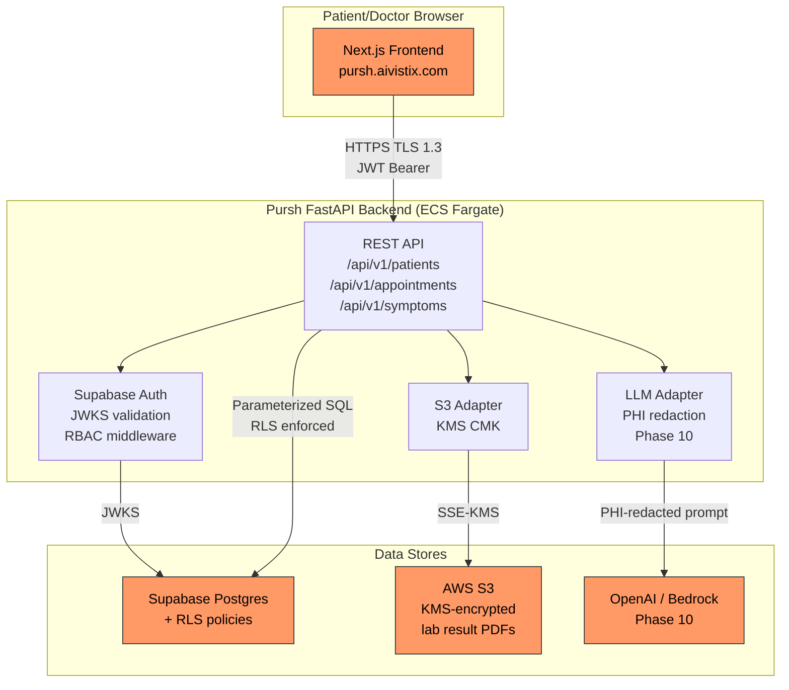

# Threat Model — Pursh Telehealth Platform (Overall)

**Version:** 1.0  
**Date:** 2026-05-19  
**Author:** Security Engineering (prabhudasuj23)  
**Methodology:** STRIDE  
**Status:** Active — review required if any trust boundary changes  
**Next review:** 2026-08-19 (90-day CI enforcement)  

---

## 1. Scope

This threat model covers the Pursh synthetic telehealth application as deployed
in this monorepo. Pursh is a **demonstration target** for AISec scanner coverage.
All data is synthetic. No real patient health information (PHI) is processed.

**In scope:**
- Patient browser → Pursh Next.js frontend
- Frontend → Pursh FastAPI backend
- Backend → Supabase (Postgres + Auth)
- Backend → AWS S3 + KMS (lab result file storage)
- Backend → LLM API (Phase 10 — AI integrations)

**Out of scope (separate threat models):**
- AISec control plane itself (`docs/threat-models/aisec-control-plane.md` — TBD)
- Pursh CI/CD pipeline (covered by AISec scanner configuration)
- Pursh infrastructure/networking (covered by Checkov + tfsec + Prowler)

---

## 2. Architecture Overview

**Trust boundaries (TB):**
- TB-1: Public internet → Pursh frontend (Next.js)
- TB-2: Frontend → Backend API (authenticated HTTPS)
- TB-3: Backend → Supabase (internal, authenticated via service key)
- TB-4: Backend → S3 (IAM role, KMS CMK)
- TB-5: Backend → LLM provider (external API, Phase 10)

---

## 3. STRIDE Threat Table

| # | STRIDE | Threat | Affected component | Mitigation | Status |
|---|---|---|---|---|---|
| T-01 | **S**poofing | Attacker forges a JWT to impersonate a patient | TB-2 — Backend Auth | RS256 JWKS validation; `exp`, `sub`, `email` claims required; `alg: none` rejected | ✅ Implemented |
| T-02 | **S**poofing | Session fixation — attacker reuses a stolen refresh token | TB-2 | Supabase Auth: refresh token rotation on every use; single-use tokens | ✅ Implemented |
| T-03 | **T**ampering | Patient modifies their own `patient_id` in request body to read another patient's records | TB-3 — Supabase RLS | RLS policy: `patient_id = auth.uid()` on all SELECT/UPDATE; server never trusts client-supplied patient ID | ✅ Implemented |
| T-04 | **T**ampering | Attacker sends crafted SARIF to poison the AISec finding DB via Pursh's CI pipeline | TB-2 — Ingest API | Schema validation (SarifDocument) before normalization; malformed input → 422 | ✅ Implemented |
| T-05 | **T**ampering | SQL injection via unsanitized symptom input | TB-3 — Supabase | SQLAlchemy ORM + parameterized queries; Semgrep rule `formatted-sql-query` in CI | ✅ Implemented |
| T-06 | **R**epudiation | Patient denies submitting a symptom report that led to a medical decision | TB-3 — audit_log | Every API write appends to `audit_log` table (actor, timestamp, before/after) per §164.312(b) | ✅ Implemented |
| T-07 | **R**epudiation | Doctor denies accessing a patient record | TB-3 — audit_log | `audit_log` captures every `SELECT` on `patient_records` with actor UUID | ✅ Implemented |
| T-08 | **I**nformation Disclosure | PHI appears in application logs | TB-2/TB-3 | Structured logging uses hashed patient IDs, never raw UUIDs or health data; `# PHI-SAFE` annotation required on all PHI-touching functions | ✅ Implemented |
| T-09 | **I**nformation Disclosure | Lab result PDF accessible without authentication via S3 presigned URL guessing | TB-4 — S3 | S3 presigned URLs expire in 15 min; bucket is private (no public ACL); HTTPS only | ✅ Implemented |
| T-10 | **I**nformation Disclosure | LLM echoes PHI back in its response (Phase 10) | TB-5 — LLM | PHI redaction layer strips patient identifiers before prompt; LLM output audited; no patient ID echoed | 📋 Planned (Phase 10) |
| T-11 | **I**nformation Disclosure | Prompt injection extracts hidden patient context from LLM (Phase 10) | TB-5 — LLM | promptfoo + Garak CI tests for injection; input length cap; allowlist on output (specialty names only for AI-1) | 📋 Planned (Phase 10) |
| T-12 | **D**enial of Service | Attacker floods `/api/v1/symptoms/check` to exhaust LLM quota (Phase 10) | TB-5 | Rate limiting: 10 req/min per authenticated user; token count cap per request; circuit breaker | 📋 Planned (Phase 10) |
| T-13 | **D**enial of Service | Large file upload exhausts S3 bandwidth or Fargate memory | TB-4 — S3 | Upload size limit: 10 MB enforced at ALB + FastAPI; content-type validation; virus scan (Phase 6) | 🔄 Partial |
| T-14 | **E**levation of Privilege | Doctor role escalation — patient crafts JWT claim `role: doctor` | TB-2 — Auth | `role` claim extracted from Supabase `app_metadata` (server-controlled, not user-settable); `require_doctor` dependency enforces at API layer | ✅ Implemented |
| T-15 | **E**levation of Privilege | Mass assignment — patient POST includes `role: doctor` in request body | TB-2 — API | Pydantic models only include declared fields; extra fields ignored by default; mypy --strict validates models | ✅ Implemented |

---

## 4. Accepted Risks

| Risk | Justification | Owner | Review date |
|---|---|---|---|
| T-10, T-11, T-12 — LLM threats | Phase 10 not yet implemented; Pursh AI features are stubs | Security Engineering | Before Phase 10 ships |
| T-13 — Large file upload | Virus scan not yet implemented; synthetic data only, no real PHI | Security Engineering | Phase 6 completion |

---

## 5. Compliance mapping

| HIPAA Section | Threats addressed |
|---|---|
| §164.312(a)(1) — Access control | T-01, T-02, T-14, T-15 |
| §164.312(b) — Audit controls | T-06, T-07 |
| §164.312(c)(1) — Integrity | T-03, T-04, T-05 |
| §164.312(d) — Authentication | T-01, T-02 |
| §164.312(e)(1) — Transmission security | T-09 (TLS 1.3, HTTPS only) |

| GDPR Article | Threats addressed |
|---|---|
| Art32(1)(a) — Pseudonymisation | T-08 (hashed IDs in logs) |
| Art32(1)(b) — Confidentiality, integrity | T-03, T-05, T-09 |
| Art32(1)(d) — Regular testing | Covered by AISec SAST/DAST/SCA pipeline |

---

## 6. Residual risk

All CRITICAL and HIGH threats are mitigated or have an accepted-risk entry above.
The Pursh threat model is re-reviewed:
- After any change to authentication logic (`pursh/backend/auth/`)
- After any change to the patient data model (`pursh/backend/api/patients.py`)
- Before any AI integration ships (Phase 10 creates TB-5)
- On a 90-day rolling schedule (enforced by CI threat-model-check action)
